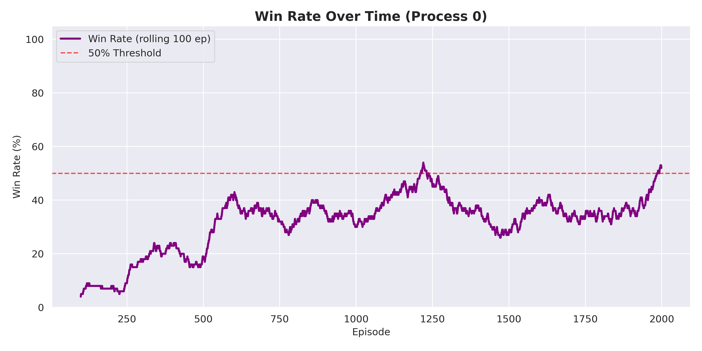
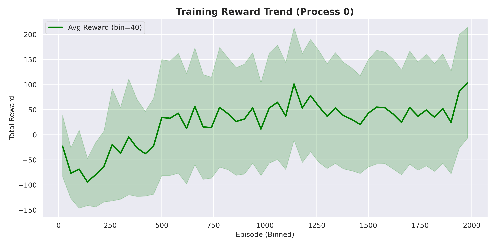
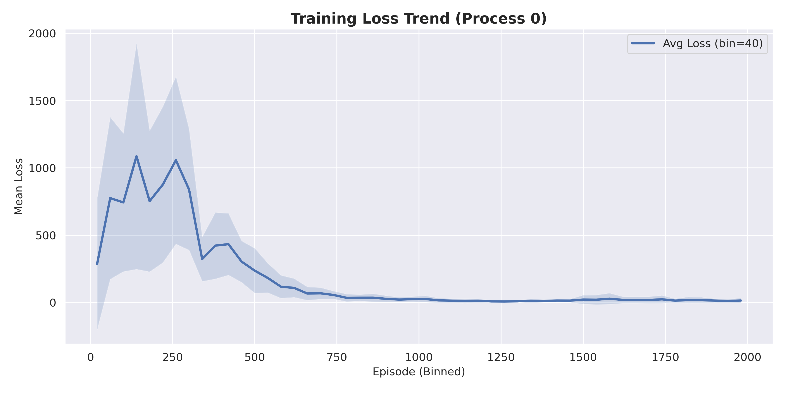

# Deep Q-Learning for MiniGrid Environments

Implementation of Deep Q-Network (DQN) for solving MiniGrid navigation tasks with multiprocessing support.

## Environment

**MiniGrid-FourRooms-v0**: A partially observable grid environment where the agent must navigate through rooms connected by doorways to reach a goal position.

## Network Architecture

```
Input Layer:  147 features (flattened observation)
Hidden Layer: 128 neurons (ReLU)
Hidden Layer: 64 neurons (ReLU)
Output Layer: 3 actions (turn left, turn right, move forward)
```

**Optimizer**: Adam
**Loss Function**: Huber Loss

## Training Results

Training was conducted with 4 parallel processes over 2000 episodes each. Representative results from one process:

### Success Rate



### Rewards



### Loss Function



## Hyperparameters

| Parameter | Value |
|-----------|-------|
| Episodes | 2000 |
| Learning Rate | 0.0005 |
| Discount Factor (gamma) | 0.5 |
| Epsilon Start | 1.0 |
| Epsilon Min | 0.1 |
| Epsilon Decay | 0.998 |
| Batch Size | 32 |
| Replay Buffer Size | 20,000 |
| Training Frequency | Every 4 steps |
| Parallel Processes | 4 |

## Usage

### Training

```bash
python3 main.py
```

The experiment tracker automatically logs metrics (loss, rewards, success rate, epsilon) to `Database/Experiments/` during training.

### Viewing Results

```bash
python3 view_plots.py
```

## Key Observations

**50% Success Rate Barrier**: Current configuration struggles to consistently exceed 50% success rate. This is likely due to:

1. **Low Discount Factor (0.5)**: FourRooms requires planning 20-30 steps ahead. With gamma=0.5, rewards decay too quickly for effective long-term planning.

2. **Exploration Strategy**: Fast epsilon decay (0.998) may cause premature convergence to suboptimal policies.

3. **Environment Complexity**: Partial observability and sparse rewards make this a challenging task.

## Suggested Improvements

```python
DISCOUNT_FACTOR = 0.95  # Better for long-horizon tasks
DECAY_RATE = 0.999      # Slower exploration decay
EPSILON_MIN = 0.15      # Higher minimum exploration
EPISODES = 5000         # More training time
```

## File Structure

```
DeepReinforcementLearning/
├── main.py                     # Main training script
├── ML_algorithms.py            # DQN implementation
├── view_plots.py               # Plot viewer utility
├── utils/
│   ├── experiment_tracker.py  # Automatic experiment tracking
│   ├── preprocessing.py       # State preprocessing
│   └── heurestics.py          # Reward shaping
├── Database/
│   ├── Images/                # Training charts
│   ├── Models/                # Saved model weights
│   └── Experiments/           # Experiment data (JSON)
└── Interfaces/                # Environment interfaces
```

## Dependencies

```bash
pip install -r requirements.txt
```

Main dependencies:
- Gymnasium
- Gymnasium[box2d]
- MiniGrid
- NumPy
- Matplotlib
- Seaborn
