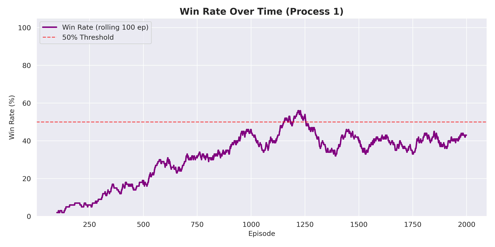
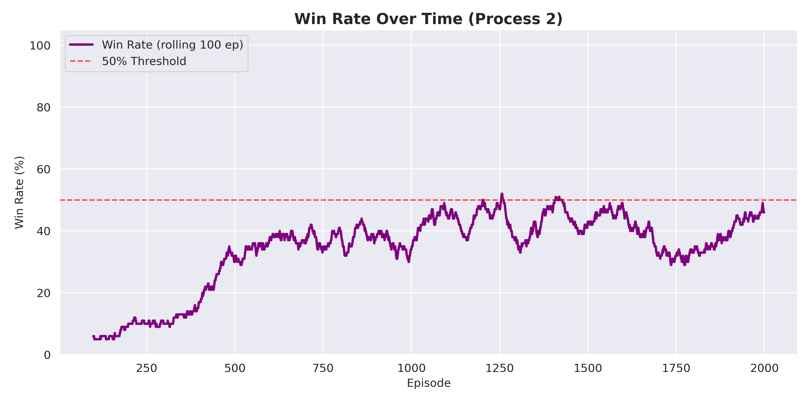
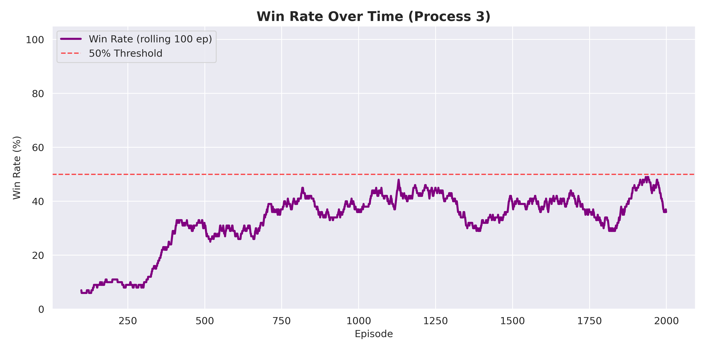
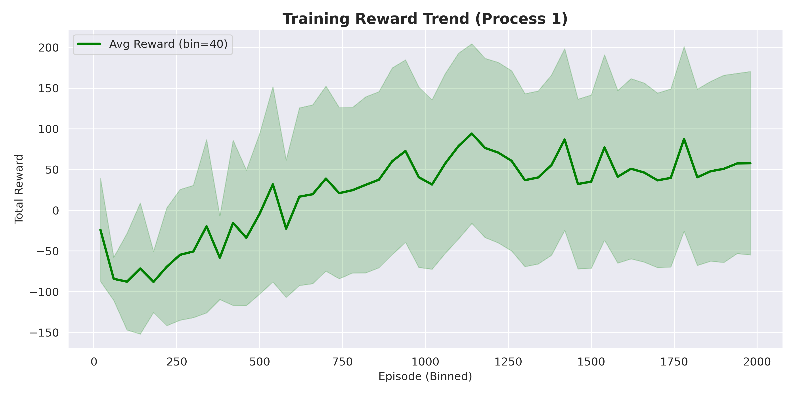
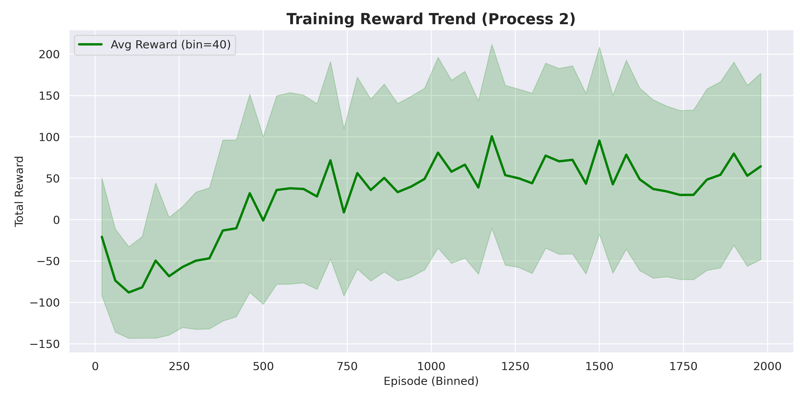
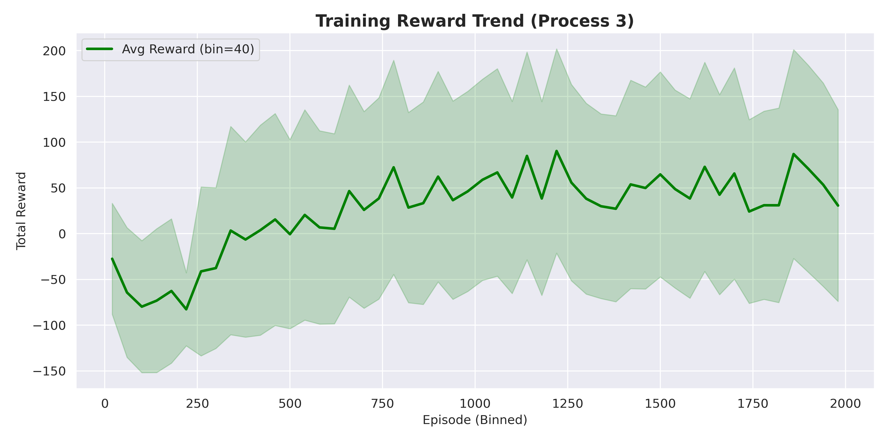
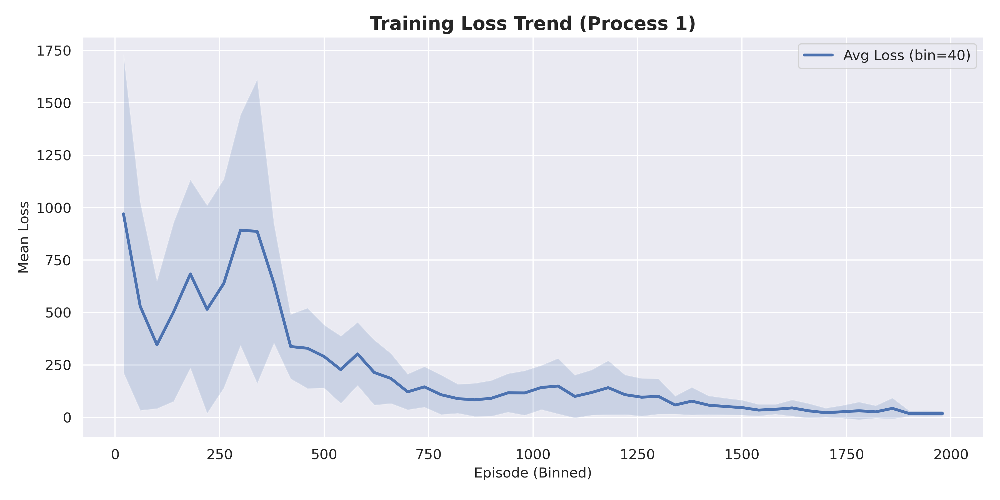
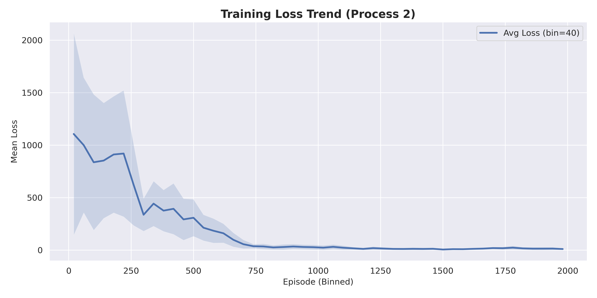
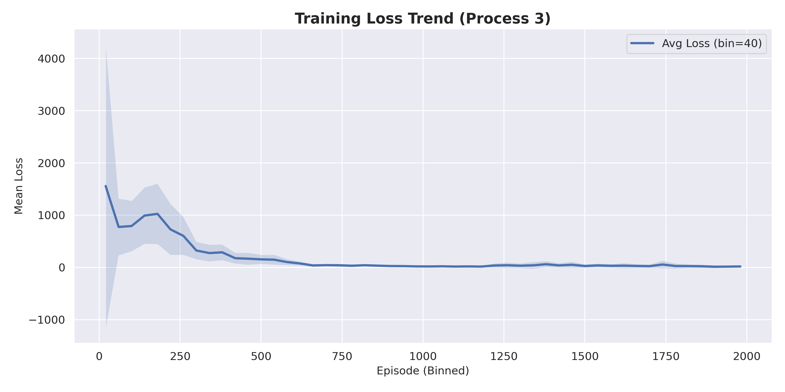

# Deep Q-Learning Experiment Report - Manual Analysis

---

## Executive Summary

**Environment**: MiniGrid-FourRooms-v0
**Total Training Processes**: 4
**Episodes per Process**: 2000

### Key Finding: 50% Success Rate Barrier

**Observation**: Unable to break the 50% success rate barrier.

- Process 0 Final Win Rate: 42%
- Process 1 Final Win Rate: 51%
- Process 2 Final Win Rate: 38%
- Process 3 Final Win Rate: 45%
- Best Peak Win Rate Achieved: 55%
- Average Final Win Rate: 40%

---

## Experiment Configuration

**Network Architecture**: 147 → 128 → 64 → 3
**Optimizer**: Adam
**Loss Function**: Huber Loss

### Hyperparameters
- **Episodes**: 2000
- **Learning Rate**: 0.0005
- **Discount Factor (γ)**: 0.5
- **Epsilon Start**: 1.0
- **Epsilon Min**: 0.1
- **Epsilon Decay**: 0.998
- **Batch Size**: 32
- **Replay Buffer**: 20,000
- **Train Frequency**: Every 4 steps

---

## Observations from Plots

### Win Rate Analysis






**Process 0**: Peaked at ~55% around episode 1200-1250, but declined to final 42%. Briefly broke the 50% threshold but couldn't maintain it. Shows significant instability and oscillation throughout training.

**Process 1**: Best performing process. Peaked at ~55-58% around episodes 1150-1200, maintaining close to 50% threshold with final rate of 51%. This was the only process to sustain performance near 50% by the end of training. High instability with continuous oscillations.

**Process 2**: Peaked at ~52-54% around episodes 1200-1300. Final win rate dropped significantly to 38%. Briefly touched 50% multiple times but showed inability to maintain it. Exhibited high instability and significant performance decline in later episodes (1400-2000).

**Process 3**: Peaked at ~48-50% around episode 1200. Never clearly broke the 50% barrier, consistently staying just below. Final rate of 45%. Moderate instability with noticeable decline in final episodes.

**Key Observations**:
- **Peak Performance**: All processes peaked around episodes 1150-1300 at approximately 50-58%
- **Instability**: Severe oscillations in all processes throughout training - no stable convergence
- **Performance Decay**: 3 out of 4 processes showed declining win rates after peak performance
- **50% Barrier**: Only Process 1 managed to stay near 50% by end; others fell well below
- **No Continued Improvement**: Win rates plateaued around episode 1200, then declined rather than continuing to improve

### Reward Trends






**Process 0**: Started at ~-75, increased dramatically through first 500 episodes, stabilized around +100 by episode 500. Final reward ~100. Shows clear learning with strong upward trend early, then plateau. High variance throughout (spikes reaching 200+).

**Process 1**: Started at ~-85, showed steady improvement throughout training. Final reward ~60. Most consistent upward trend, though slower improvement after episode 800. High variance with peaks around 100-200.

**Process 2**: Started at ~-75, improved to ~60-70. Clear improvement in first 500 episodes, then plateau with high oscillations. Final reward ~60. More volatile than other processes with sustained high variance.

**Process 3**: Started at ~-75, final reward ~40-50. Steady improvement through episode 1000, followed by slight decline. Less stable than others with consistently high variance.

**Key Observations**:
- **Positive Trend**: All processes showed improvement from large negative rewards (-75 to -85) to positive rewards
- **Early Learning**: Most dramatic improvement occurred in first 500 episodes
- **Plateau Effect**: After episode 500-800, rewards plateaued rather than continuing to improve
- **High Variance**: All processes exhibited substantial variance throughout training (shaded areas), indicating inconsistent episode performance
- **Process Divergence**: Final rewards ranged widely from 40-100, suggesting high sensitivity to initialization

### Loss Behavior






**Process 0**: Started at ~300, spiked to 1000-1100 during episodes 100-200 (learning instability), then decreased significantly. Stabilized near 0 after episode 700. Very low and stable loss in later training. High variance only in first 500 episodes.

**Process 1**: Started at ~1000, fluctuated with peak at ~900 around episode 250. Decreased to 200-300 by episode 500, stabilized at 50-100 after episode 700. Relatively stable in later training with some persisting variance through middle episodes.

**Process 2**: Started very high at ~1100, decreased steadily through episode 600. Stabilized near 0 after episode 800. Very stable and low in later training. High variance only in first 600 episodes.

**Process 3**: Started extremely high at 3000-4000 (highest of all processes), dropped quickly but remained around 800-1000 through episodes 100-200. Decreased to near 0 by episode 600. Very stable and low in later training. Extremely high initial variance.

**Key Observations**:
- **Good Convergence**: All processes successfully decreased loss from high initial values to near-zero by episodes 600-800
- **Training Stability**: After initial high-variance period (first 300-600 episodes), training became very stable
- **Early Instability**: All processes showed high loss variance in early training, typical of network initialization
- **Concerning Pattern**: Despite good loss convergence, win rates did NOT improve proportionally after episode 800
- **Loss-Performance Disconnect**: Low, stable loss after episode 800 did not translate to stable or improving win rates, suggesting potential overfitting or that the learned Q-values don't generalize well to actual policy performance

---

## Analysis: The 50% Barrier Problem

### Possible Reasons for the Barrier

#### 1. Low Discount Factor
**Possible critical issue**: γ = 0.5 is very low for FourRooms
- This environment requires long-term planning (many steps to goal)
- With γ=0.5, rewards 10 steps away are worth only 0.1% of immediate reward
- Agent cannot learn to value distant goals effectively

**Future recomendations**: Increase to γ = 0.95-0.99

#### 2. Exploration Strategy
- Epsilon decay (0.998) might be too fast
- Minimum epsilon (0.1) might be too low for complex environment
- Agent may converge to suboptimal policy before finding better solutions

**Recommendation**:
- Slower decay: 0.999 or 0.9995
- Higher minimum: 0.15-0.20

#### 3. Environment Complexity
- FourRooms requires sophisticated navigation through doorways
- Partial observability (7×7 grid view) adds difficulty
- Sparse rewards make learning difficult

**Recommendation**: Consider curriculum learning
- Start with MiniGrid-Empty-8x8-v0 (simpler)
- Move to FourRooms after achieving 80%+ success

#### 4. Reward Shaping
- Current heuristic may not provide sufficient learning signal
- Need to verify heuristic is helping, not hindering

**Recommendation**: Experiment with different reward structures

#### 5. Network Architecture
- Current: 128 → 64 (relatively small)
- May lack capacity for complex environment

**Recommendation**: Try deeper/wider network
- 256 → 128 → 64
- Consider Dueling DQN architecture

---

## Recommendations

### HIGH PRIORITY

1. **Increase Discount Factor**
   ```python
   DISCOUNT_FACTOR = 0.95  # or 0.99
   ```
   This is likely the primary issue. FourRooms needs long-term planning.

2. **Adjust Exploration**
   ```python
   DECAY_RATE = 0.999      # slower decay
   EPSYLON_MIN = 0.15      # higher minimum
   ```

3. **Try Simpler Environment First**
   ```python
   ENV_NAME = ENV_EMPTY_8x8
   ```
   Verify your implementation works on simpler task.

### MEDIUM PRIORITY

4. **Larger Network**
   ```python
   'neurons': 256  # first layer
   'neurons': 128  # second layer
   'neurons': 64   # third layer
   ```

5. **Adjust Learning Rate**
   ```python
   LR = 0.0003  # try lower
   # or
   LR = 0.001   # try higher
   ```

6. **Longer Training**
   ```python
   EPISODES = 5000  # more time to learn
   ```

### ADVANCED

7. **Prioritized Experience Replay**
8. **Double DQN**
10. **Different Algorithm** (PPO, SAC)

---

## Conclusion

The consistent failure to break 50% success rate across multiple independent runs
suggests systematic limitations in the current approach, most likely:

1. **Discount factor too low** for long-horizon task (γ=0.5 → should be 0.95+)
2. **Exploration insufficient** for finding good policies
3. **Environment too complex** for current configuration

### Next Steps:

1. Set `DISCOUNT_FACTOR = 0.95`
2. Set `DECAY_RATE = 0.999`
3. Set `EPSYLON_MIN = 0.15`
4. Increase `EPISODES = 5000`
5. Run 4 parallel training processes again
6. Use automatic experiment tracking

---

## Plots Reference

Training plots are available in `Database/Images/`:
- `winrate_chart_proc_0.png` through `winrate_chart_proc_3.png`
- `loss_chart_proc_0.png` through `loss_chart_proc_3.png`
- `rewards_chart_proc_0.png` through `rewards_chart_proc_3.png`

---
